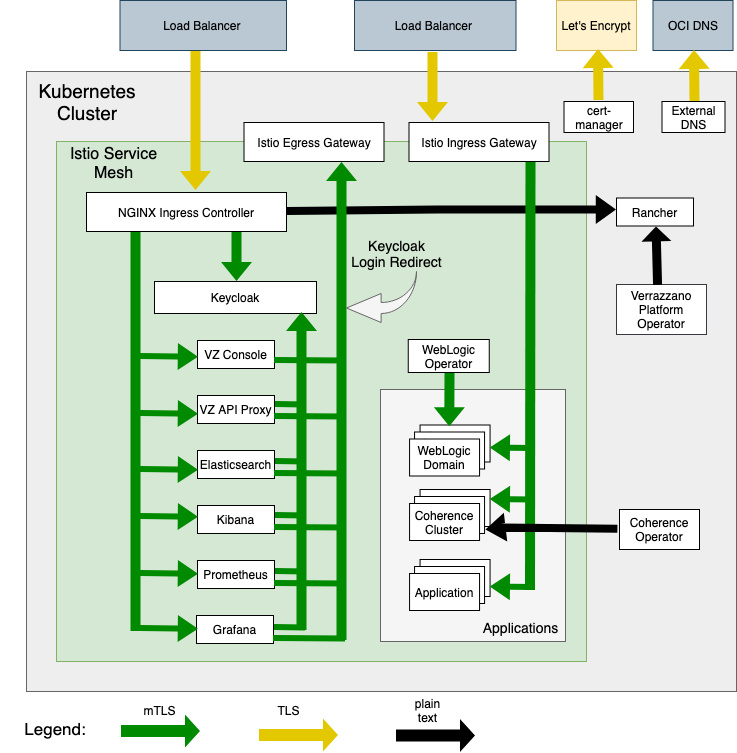

A Verrazzano instance is comprised of both Verrazzano components and several 
third party products. Collectively, these components are called the Verrazzano 
system components.  In addition, a Verrazzano instance can include applications 
deployed by the user, after Verrazzano is installed.  Applications can also be
referred to as components, not to be confused with OAM components.  

All of the system components and applications use the network to some degree.  Verrazzano 
configures networking to provide network security and traffic management.  Network 
settings are configured both at installation and during runtime as applications as are 
deployed into the Kubernetes cluster.

### High Level Overview
The diagram below shows the high-level overview of Verrazzano networking for a sample
deployment on an OKE cluster using OCI DNS and Let's Encrypt for certificates.  This
diagram does not show Prometheus scraping. 

Verrazzano system traffic enters an OCI load balancer over TLS and is routed to the
NGINX Ingress Controller, where TLS is terminated.  From there, the traffic is routed 
to one of several destinations, all in the Istio mesh over mTLS. All of the traffic 
in the mesh uses mTLS, with the following exceptions:
- traffic from the NGINX Ingress Controller to Rancher
- traffic from Coherence operator to the Coherence cluster
- Prometheus traffic, which uses HTTP or HTTPS (not shown)

***NOTE*** Several components inside the cluster send requests to Keycloak and will
always go outside the cluster, back through the load balancer if a Keycloak redirect
is needed.  If some cases, where no redirect is needed, they will send requests directly 
to Keycloak within the cluster.

ExternalDNS runs outside the mesh and uses TLS.  The same is true for
cert-manager.

Application traffic enters a second OCI load balancer over TLS and is routed to the
Istio Ingress Gateway, where TLS is terminated. From there, the traffic is routed 
to one of several applications using mTLS, all in the mesh for this example.

With the exception of Prometheus scraping, and interaction with Kubernetes servers, these
are all of the network traffic patterns used by Verrazzano in a single cluster topology.
Applications may introduce new traffic patterns as might be expected. 

#### High Level Network Diagram

### Network configuration during installation
A summary of the network related configuration follows.

Verrazzano does the following as it relates to networking:
1. installs and configures NGINX Ingress Controller
1. creates Ingress resources for system components
1. installs and configures Istio
1. enables strict mTLS for the mesh by creating an Istio PeerAuthentication resource
1. creates an Istio egress gateway service
1. creates an Istio ingress gateway service
1. configures several Verrazzano system components to be in the mesh.  
1. optionally installs ExternalDNS and creates DNS records
1. creates certificates required by TLS used by system components
1. creates certificates required by Kubernetes API server to call webhook
1. creates NetworkPolicies for all of the system components.

### Network configuration during application lifecycle
Verrazzano does the following as it relates to applications being deployed and terminated
1. optionally creates an Istio Gateway and VirtualService resources
1. creates Istio AuthorizationPolicies as needed
1. creates Istio DestinationRules as needed
1. optionally creates a self-signed certificate for the application
1. optionally creates DNS records using external DNS.
